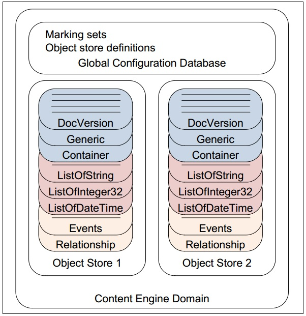

# Соединение

Здесь будут рассмотрены процесс соединения с сервером CE, получение объекта хранилища данных (ObjectStore), а также типы Connection, UserContext, Domain, ObjectStore, EngineRuntimeException.

## Исходные данные

Указаны имена переменных из примера кода (см. ниже).

* uri: URI для подключения к CE - String. Пример: "http://172.19.215.15:9080/wsi/FNCEWS40MTOM/"
* login:  имя пользователя - String
* password: пароль - String
* objectStoreName: имя Object Store - String

Вид URI для подключения к CE зависит от протокола. Для подключения по http (Web Services) изспользуется URI вида http://server:port/wsi/FNCEWS40MTOM/

## Общий порядок действий при работе с хранилищем объектов

1. Получить объект Connection
2. Получить объект UserContext
3. Создать объект javax.security.auth.Subject
4. Сделать полученный Subject активным (pushSubject)
5. Получить объект Domain
6. Получить объект ObjectStore
7. Выполнить необходимую работу с данными (получение, изменение, удаление...)
8. Вернуть предыдущий Subject (pushSubject)

Важно: каждому вызову pushSubject() должен соответствовать вызов popSubject().

## Пример кода

Порядок действий иллюстрирует пример кода. 
Метод popSubject() необходимо вызывать в блоке finally, чтобы гарантировать его исполнение.

```java
Connection conn = Factory.Connection.getConnection(uri);
userContext = UserContext.get();
subject = UserContext.createSubject(conn, login, password, null);

UserContext.pushSubject(subject);

try {
    Domain domain = Factory.Domain.getInstance(conn, null);

    objectStore = Factory.ObjectStore.fetchInstance(domain,
            objectStoreName, null);
            
    //работа с данными

} catch (EngineRuntimeException ex) {
    throw new Exception(ex.getExceptionCode().toString());
} finally {
    UserContext.popSubject();
}
```

## Connection

Интерфейс [Connection](https://www.ibm.com/support/knowledgecenter/en/SSNW2F_5.1.0/com.ibm.p8.ce.dev.java.doc/com/filenet/api/core/Connection.html) представляет логическое соединение с CE. Для получения объекта Connection используется один из двух методов фабричного класса Factory.Connection:

`public static Connection getConnection( java.lang.String uri)`

`public static Connection getConnection( java.lang.String uri, ConfigurationParameters parameters)`

Первый метод создаёт соединение с параметрами по умолчанию.

## UserContext

Класс [UserContext](https://www.ibm.com/support/knowledgecenter/SSNW2F_5.2.1/com.ibm.p8.ce.dev.java.doc/com/filenet/api/util/UserContext.html) используется для установки локали и параметров аутентификации. Эта информация подставляется в запросы к серверу CE, которые отправляет текущий поток (т.е. поток, с которым связан объект UserContext). 
Для каждого потока имеется свой стек из объектов Subject (JAAS). Также предоставляется возможность работать с внешним (ambient) JAAS-субъектом. В этом случае, внутренний стек игнорируется.

Основные методы:

метод | что делает
------------ | -------------
`static javax.security.auth.Subject createSubject(Connection conn, java.lang.String user, java.lang.String password, java.lang.String optionalJAASStanzaName)` | Создать субъект средствами JAAS. Последний параметр можно указать null, в этом случае stanza будет «FileNetP8»
`static UserContext get()` | Получить объект UserContext, связанный с текущим потоком
`javax.security.auth.Subject getSubject()` | Получить объект Subject, связанный с текущим потоком
`javax.security.auth.Subject popSubject()` | Извлечь из стека текущий активный SUbject и сделать активным предыдущий SUbject
`void pushSubject(javax.security.auth.Subject sub)` | Поместить sub на вершину стека
`java.util.Locale getLocale()` | Получить текущую локаль для данного контекста
`void setLocale(java.util.Locale locale)` | Установить локаль в данном контексте

## Domain

Интерфейс [Domain](http://www.ibm.com/support/knowledgecenter/SSNW2F_4.5.1/com.ibm.p8.doc/developer_help/content_engine_api/javadocs/com/filenet/api/core/Domain.html) представляет доступ к домену CE. Домен – объект, состоящий из базы данных глобальной конфигурации (GCD) и одной или нескольких баз данных – хранилищ объектов (Object Stores).



Для получения объекта Domain используется методы фабричного класса Factory.Domain:

`static Domain fetchInstance(Connection conn, java.lang.String name, PropertyFilter filter)`

`static Domain getInstance(Connection conn, java.lang.String name)`

О различии методов fetchInstance() и getInstance() написано [здесь](instance_methods.md).

Если параметр `name` равен null, используется домен по умолчанию.

### Пример кода

Печать имён всех object store.

```java
Connection conn = Factory.Connection.getConnection(uri);
    Subject subject = UserContext.createSubject(conn, username, password, null);
    UserContext.get().pushSubject(subject);
        
    try
    {
       // Get default domain.
       Domain domain = Factory.Domain.fetchInstance(conn, null, null);
       System.out.println("Domain: " + domain.get_Name());

       // Get object stores for domain.
       ObjectStoreSet osSet = domain.get_ObjectStores();
       ObjectStore store;
       Iterator osIter = osSet.iterator();

       while (osIter.hasNext() == true) 
       {
          store = (ObjectStore) osIter.next();
          System.out.println("Object store: " + store.get_Name());
       }
       System.out.println("Connection to Content Platform Engine successful");
    }
    finally
    {
       UserContext.get().popSubject();
    }
```

## ObjectStore

Интерфейс [ObjectStore](https://www.ibm.com/support/knowledgecenter/SSGLW6_5.2.0/com.ibm.p8.ce.dev.java.doc/com/filenet/api/core/ObjectStore.html) предоставляет доступ к хранилищу объектов. Хранилище объектов – база данных, содержащая классы, объекты и метаданные. В пределах домена логически разделённые данные могут храниться в разных хранилищах объектов.

Существует несколько способов получить объект ObjectStore:
* Создание нового хранилища – Factory.ObjectStore.createInstance
* Получение хранилища по ID или имени: Factory.ObjectStore.fetchInstance и Factory.ObjectStore.getInstance
* Если есть доступ к объекту RepositoryObject – возвращаемое значение метода getObjectStore()

Некоторые методы:

метод | что делает
------------ | -------------
`ChoiceListSet get_ChoiceLists()`|Получить списки выбора (объекты ChoiceList), принадлежащие данному хранилищу
`ClassDescriptionSet get_ClassDescriptions()` |Получить описания классов, определённых в хранилище
`Domain get_Domain() `|Получить домен, в котором расположено хранилище
`java.lang.String get_Name() `|Получить локализованное имя хранилища
`Id get_ObjectStoreId() `|Получить Id хранилища
`PropertyTemplateSet get_PropertyTemplates() `|Получить шаблоны свойств (объекты PropertyTemplate), принадлежащие хранилищу
`ClassDefinitionSet get_RootClassDefinitions() `|Получить определения классов верхнего уровня (т.е. классов, у которых нет родительского класса. Сюда входят базовые Containable-классы Document, Folder, CustomObject, а также служебные классы, такие как PropertyTemplate или ChoiceList)
`Folder get_RootFolder() `| Получить корневую папку ("/")

*Примечание: поскольку методы, начинающиеся с get_ и set_, являются геттерами и сеттерами некоего свойства, они часто представлены парами. В списке указаны только методы get_.*

## EngineRuntimeException

Класс [EngineRuntimeException](https://www.ibm.com/support/knowledgecenter/SSNW2F_5.0.0/com.ibm.p8.ce.dev.java.doc/com/filenet/api/exception/EngineRuntimeException.html) - единственный класс исключений в CE API. Оносится к исключениям времени выполнения (runtime), т.е. непроверяемым (unchecked). Каждый "пойманный" объект EngineRuntimeException содержит объект типа [ExceptionCode](https://www.ibm.com/support/knowledgecenter/en/SSNW2F_5.0.0/com.ibm.p8.ce.dev.java.doc/com/filenet/api/exception/ExceptionCode.html), представляющий причину ошибки. Метод 

`ExceptionCode getExceptionCode()` 

возвращает объект ExceptionCode.

### Пример кода

Данный пример показывает, как обрабатывать исключения CE нескольких видов.

```java
try {
    // что-то делаем
}
catch( EngineRuntimeException ex) {
    ExceptionCode e = ex.getExceptionCode();
    
    if( e == ExceptionCode.E_OBJECT_NOT_FOUND ) {
        // обрабатываем исключение "объект не найден"
    }
    else if ( e == ExceptionCode.E_NOT_UNIQUE )
    {
        // обрабатываем исключение "не уникален"
    }
    else
        // не можем обработать (неожиданное исключение). бросаем заново
        throw ex;
}
```
