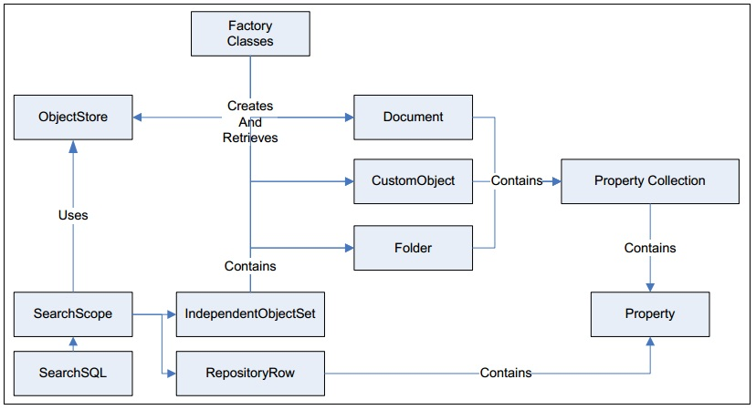

# Обзор типов

Отношения между некоторыми классами и интерфейсами упрощённо показаны на рисунке ниже:

Рассмотрим некоторые типы, определяемые различными пакетами CE API.

## com.filenet.api.core

### Классы

* Batch и его подклассы RetrievingBatch и UpdatinhBatch
* фабричные классы Factory.XXXX

### Интерфейсы

* [EngineObject](https://www.ibm.com/support/knowledgecenter/en/SSNW2F_5.2.0/com.ibm.p8.ce.dev.java.doc/com/filenet/api/core/EngineObject.html). Базовый интерфейс всех объектов CE, необязательно принадлежащих ObjectStore
* [RepositoryObject](https://www.ibm.com/support/knowledgecenter/en/SSNW2F_5.2.0/com.ibm.p8.ce.dev.java.doc/com/filenet/api/core/RepositoryObject.html). Базовый интерфейс для объектов CE, принадлежащих Object Store. Соответственно, объявляет метод getObjectStore().
* DependentObject. Объекты, которые могут существовать только как составные части других объектов. Например, Объект PropertyDefinition может существовать только в рамках объекта ClassDefinition
* [IndependentObject](https://www.ibm.com/support/knowledgecenter/en/SSNW2F_5.0.0/com.ibm.p8.ce.dev.java.doc/com/filenet/api/core/IndependentObject.html). Объекты, которые могут существовать независимо от других объектов
* [IndependentlyPersistableObject](https://www.ibm.com/support/knowledgecenter/en/SSNW2F_5.0.0/com.ibm.p8.ce.dev.java.doc/com/filenet/api/core/IndependentlyPersistableObject.html). Независимые объекты, которые можно создавать, обновлять, удалять
* [Containable](https://www.ibm.com/support/knowledgecenter/en/SSNW2F_5.2.0/com.ibm.p8.ce.dev.java.doc/com/filenet/api/core/Containable.html). Базовый интерфейс для объектов, которые могут быть содержимым папок. Подтипы: Document, Folder, CustomObject
* [Versionable](https://www.ibm.com/support/knowledgecenter/en/SSNW2F_5.2.0/com.ibm.p8.ce.dev.java.doc/com/filenet/api/core/Versionable.html). Базовый интерфейс для версионных объектов. Подтипы: Document
* EntireNetwork. Объект, находящийся на самом высоком уровне иерархии объектов CE. Имеет методы для получения объекта Domain и объектов Realm (области логических связанных пользователей и групп)
* Document. Версия документа хранилища
* Folder.	Контейнер, который хранит объекты Containable (сам также является Containable). Не обладает версионностью, не может иметь элементы содержимого
* CustomObject. Простой Containable объект. Не обладает версионностью, не может иметь элементы содержимого
* Connection.	Логическое соединение с CE
* Link.	Связь между двумя объектами типа IndependentObject. Ссылка имеет свойства Head и Tail типа IndependentObject
* [ContentElement](https://www.ibm.com/support/knowledgecenter/en/SSNW2F_5.2.0/com.ibm.p8.ce.dev.java.doc/com/filenet/api/core/ContentElement.html). Базовый класс для элементов содержимого, которые могут приндалежать объектам Document или Annotation
* [Relationship](https://www.ibm.com/support/knowledgecenter/en/SSNW2F_5.2.0/com.ibm.p8.ce.dev.java.doc/com/filenet/api/core/Relationship.html)
* [VersionSeries](https://www.ibm.com/support/knowledgecenter/en/SSNW2F_5.2.0/com.ibm.p8.ce.dev.java.doc/com/filenet/api/core/VersionSeries.html). Представляет набор версий Versionable-объекта 

## com.filenet.api.meta

* ClassDescription. Описание класса. Только для чтения
* PropertyDescription. Базовый интерфейс для описаний свойств различных типов. Только для чтения
* PropertyDescriptionDateTime. Описание свойства типа «Дата и время». Только для чтения

## com.filenet.api.admin

* ClassDefinition. Определение класса. Базовый интерфейс для DocumentClassDefinition и других
* PropertyDefinition. Базовый интерфейс для определения свойств различных типов
* PropertyDefinitionDateTime. Определение свойства типа «Дата и время»
* PropertyTemplate. Базовый интерфейс для шаблонов свойств. Шаблоны позволяют создавать однотипные определения свойств (PropertyDefinition) для разных классов
* DirectoryConfiguration. Экземпляр конфигурации LDAP
* PEConnectionPoint. ТОчка подключения к FileNet Process Engine	
* ServerInstance. JVM, запущенная на сервере приложений
* TableDefinition. Таблица БД хранилища объектов

## com.filenet.api.security

* User. Пользователь CE
* Group. Группа, в которую могут быть добавлены пользователи CE
* AccessPermission. Правило доступа, содержащее битовую маску. 
* MarkingSet. Набор маркировок. Предназначен для управления правами доступа к объекту в зависимости от значения определённого свойства типа String.

## com.filenet.api.query

* SearchScope. Область поиска (чаще всего – в пределах одного ObjectStore). Содержит методы для извлечения объектов и данных.
* RepositoryRow. Экземпляр набора свойств, получаемого при поиске. Располагает объектом Properties

## com.filenet.api.collection

* FolderSet. Коллекция объектов Folder
* ContentElementList. Коллекция объектов ContentReference и ContentTransfer

## com.filenet.api.events

* FileEvent	
* UnfileEvent	
* EventAction	
* InstanceSubscription	

## com.filenet.api.property

* Properties. Коллекция объектов Property
* Property. Базовый интерфейс для свойств
* PropertyDateTime. Свойство типа «Дата и время» мощности single
* PropertyDateTimeList. Свойство типа «Дата и время» мощности list
* PropertyFilter. Набор информации о том, какие свойства объекта CE нужно извлечь. Используется в таких операциях, как fetch и refresh

## com.filenet.api.constants

* AccessRight. Константы прав доступа (READ, WRITE и т.п.)
* Cardinality. Мощность значения свойства (SINGLE, LIST)
* DatabaseType. Тип используемой СУБД (DB2, ORACLE, …)
* PropertyNames. Имена свойств
* ReservationType. Тип резервации документа (COLLABORATIVE, EXCLUSIVE)
